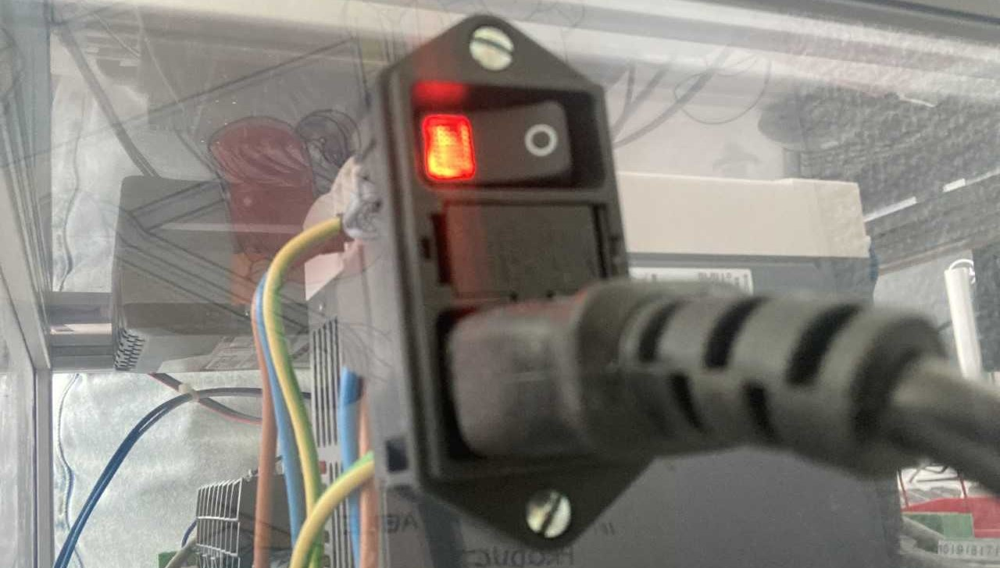
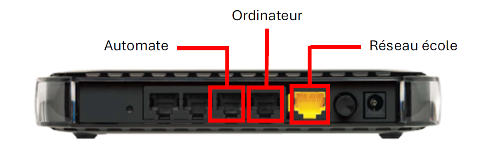
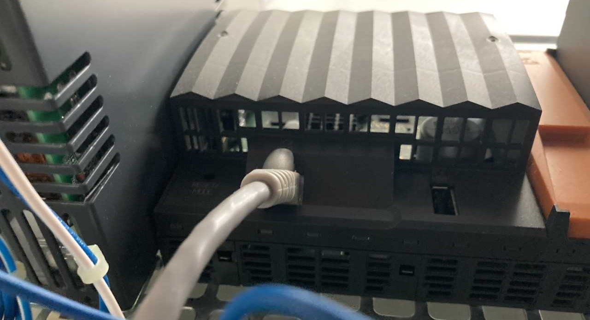
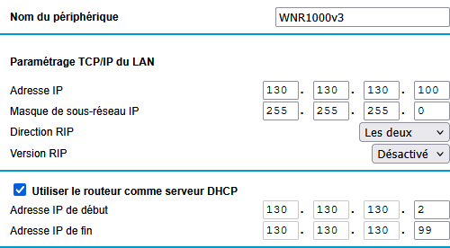

# Orion
## Websummary
### Description
As part of my TPI, I designed an advanced 3D visualization application capable of
communicating with a programmable controller developed by the *automatic* sector of
CPNE-TI. The objective of the latter is to make a rubber sphere move using stepper motors,
so that it indicates by means of a marker the direction of a chosen object in the sky.

My job was to program the visualization software and calculate the data
necessary for the motors to move, using the Raylib graphics library in C#.

### Objectives

- Understand and interpret astronomical and geographic data in order to
determine a realistic orientation towards the given position, all within a 
three-dimensional environment.
 - Implement innovative visualization means in a 3D environment
using a simple and lightweight graphics library.
 - Apply the principles of continuous integration studied during training and create a
complete deliverable for users.
 - Understand the principles of the Websocket protocol and apply them in order to
communicate with an undocumented programmable controller.

### Realisation

The project began on the basis of the already existing application created by me during the
previous season. The TPI periods were therefore devoted to adding crucial functionalities
and to the technical outcome of the software.
I finalized the project by linking the application to the programmable controller in order to make good use
of the virtual simulations present in the application.
Particular attention was paid to the graphic aspect of the software. By making use of
GLSL Shaders and advanced algorithms, I managed to give a professional and resulted 
visual to the 3D environment.

## Setup
### Download

Below you will find the procedure to follow allowing you to set up the project under minimal conditions, that is to say on a machine free of any software component. You are also explained how to connect the PLC and the PC through a router.

First of all, go to the [Releases](https://git.s2.rpn.ch/ComtesseE1/orion/-/releases) of the Github repository. Download the executable of the latest released version as it is made available and extract it on your machine. However, once extracted, the software will not be able to function in the supplied state. Gitlab's previous restrictions preventing the saving of files that were too large as artifacts made it impossible to attach the *assets* of the application to the release. This is why you also need to clone the main repository at home in order to get the *assets* folder, then copy it into the executable directory.

From now on, you are able to start the application without any compilation being necessary. However, if you want to do the full installation which includes the PLC, you still need to connect your PC to it so that the software can communicate with it.

### Connection to the PLC

To begin, start the system using the orange switch on the back of the case:

It then takes a few minutes to start all its components. You
can take advantage of this time to plug the router into an electrical outlet, then
route the Ethernet cables as follows:

You may have noticed several Ethernet cables connected to the controller
and you may be wondering which one to plug into the router. Use this one:

Finally, you still have to configure the router so that it
distributes addresses correctly between the robot and the computer thanks to the
DHCP protocol. To do this, start by restarting the
Netgear router by holding down the *reset* button for at least 10 seconds
at the back. Then go to an Internet browser and enter
the following address: 192.168.1.1. You will then be offered a certain type of
automatic configuration; click No. You can then go to
the address routerlogin.net/start.htm, from which you will configure the
distribution of IP addresses between different clients.

Go to : **Advanced -> Configuration -> LAN Settings** and enter the following data, 
so that it matches the static address of the PLC :

    

You can now start the application using the executable and
the connection should be established within the first 15 seconds. However, if you
get an error message in the terminal console, this 
probably means another connection with the Websocket is already open
somewhere on your machine. In this case, close all web interfaces
likely to be connected to it.
